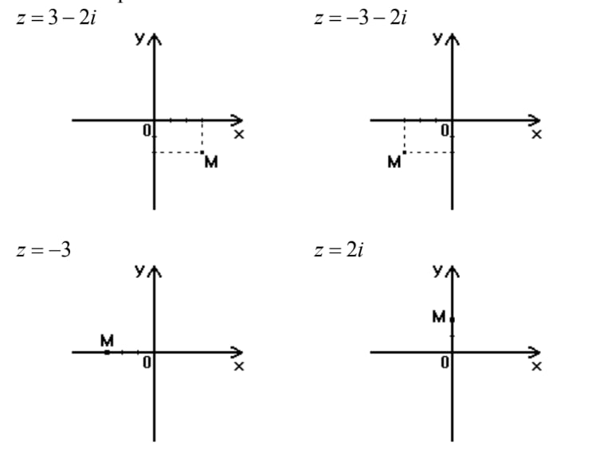
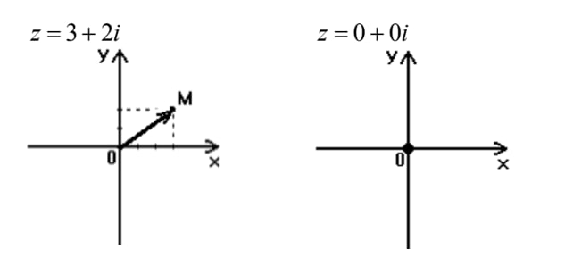

---
# Комплексные числа

> ${i^{def}=\sqrt{-1}}$

${x^2=-1, x = \pm i}$  

### Алгебраическая форма комплексного числа  
${z = (x_iy) = x + iy}$, где ${x = Re(z)}$ - действительная часть, ${y = Im(z)}$ - мнимая часть.

## Операции над комплексными числами

${z_1 = x_1 + iy_1, z_2 = x_2 + iy_2}$ 
1. ${z_1 + z_2 = (x_1 + x_2)+i(y_1+y_2)}$
2. ${z_1 * z_2 = (x_1x_2 - y_1y_2)+i(x_1y_2 + x_2y_1)}$ 
3. ${{z_1 \over z_2} = \frac{(x_1 +iy_1)(x_2-iy_2)}{x^2 + y^2} = \frac{x_1x_2+y_1y_2}{x_2^2+y_2^2} + i\frac{x_2y_1 - x_1y_2}{x_2^2+y_2^2} }$

### Комплексное число точкой

### Комплексное число вектором

> Определение.  
> Модулем комплексного числа называется длина вектора, соответсвующего этому числу.
> ${|z| = \sqrt{x^2+y^2}}$

> Определение.  
> Аргументом комплексного числа ${z \not ={0}}$ называется угол между положительным направлением действительной оси и вектором z, причем, в правой системе координат угол считается положительным, если он измеряется против часовой стрелки, и отрицательным, если измерение угла производится по часовой стрелке.
> ${Argz = \alpha, sin\alpha = \frac{y}{|z|}, cos\alpha = \frac{x}{|z|}}$.

${argz = \alpha \in [-\pi;\pi]}$. ${\alpha}$ должен лежать в той же четверти что и вектор комплексного числа.

## Тригонометрическая форма комплексного числа.
${z = (x_iy) = x + iy = |z|(\frac{x}{|z|}+i\frac{y}{|z|})=|z|(\cos\alpha+i\sin\alpha)}$  

---

${z_1*z_2=|z_1||z_2|(\cos{(\alpha_1+\alpha_2)} + i\sin{(\alpha_1+\alpha_2)})}$  

---

${\frac{z_1}{z_2}=\frac{|z_1|}{|z_2|}(\cos{(\alpha_1-\alpha_2)} + i\sin{(\alpha_1-\alpha_2)})}$

### Формула Муавра

${z^n = (\cos{(\alpha*n)} + i\sin{(\alpha*n)})}$

### Извлечение корня
> Все корни n-ой степени можно найти по формуле ${z^{1 \over n} = r^{1\over n} (\cos{{\alpha +2\pi k} \over n} +i\sin{{\alpha +2\pi k} \over n})}$, где ${\alpha}$ - одно из значений ${Argz}$.