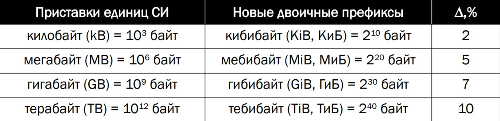

# Информатика

 
Из таблицы следует, что кило < киби, мега < меби, и т.д. 

${X_q}$ - запись числа x в системе счисления q, тогда  
${X_q = \sum^{n-1}_{i=-m}x_iq^i}$.

---

> Система счисления - это совокупнуть символов и правил для обозначения чисел.

Системы счисления подразделяются на:
* непозиционные 
* позиционные 

В непозиционных системах вес цифры не зависит от её позиции. 

Для вычислительной техники характерно использование позиционных систем счисления.