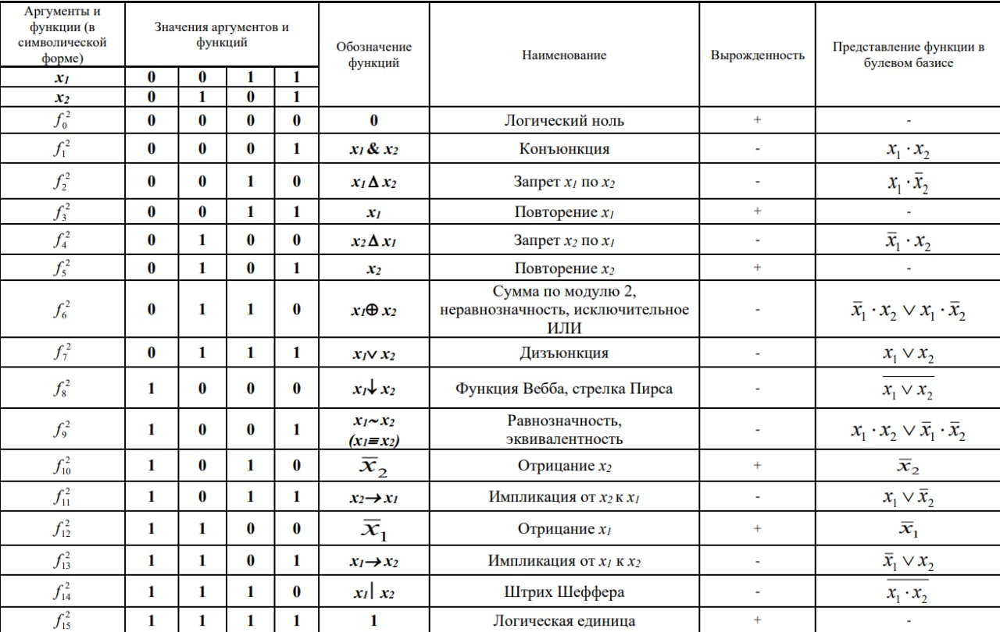
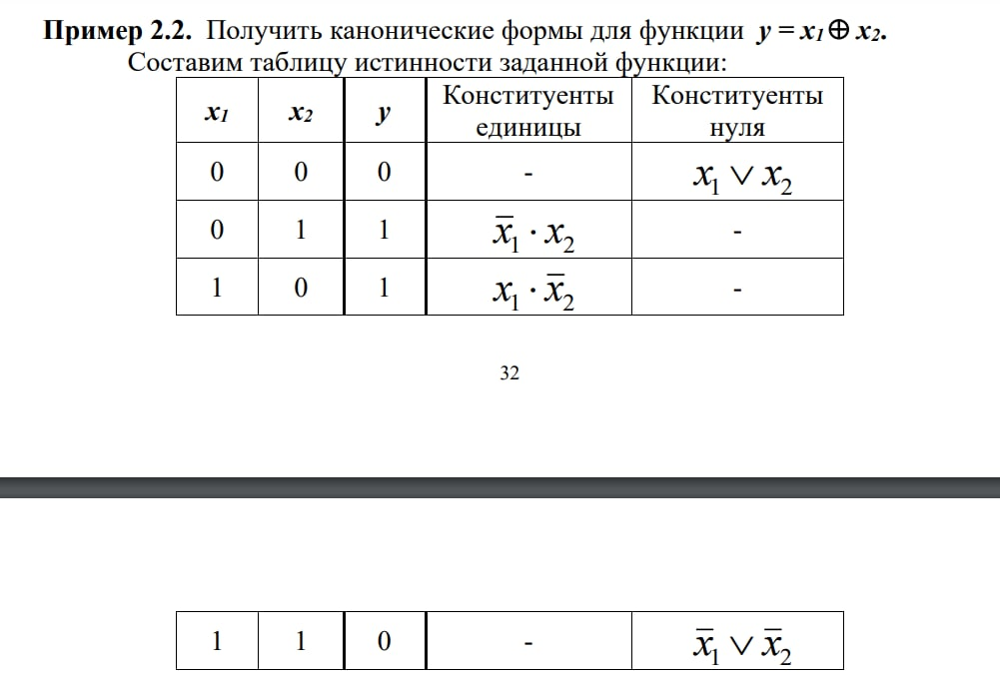
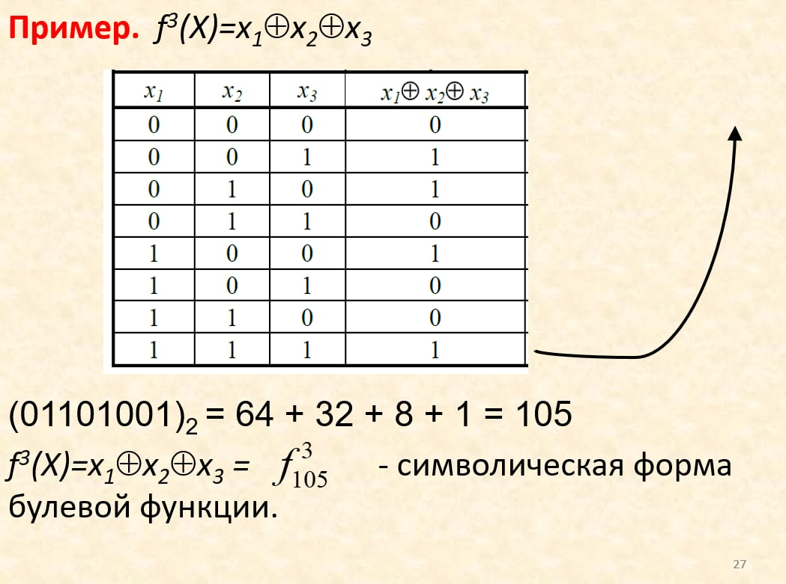

# Приложение булевой алгебры к синтезу комбинационных схем

Теоретическим фундаментов современных ЭВМ ялвяется алгебра логики, основы которой разработал Дж. Буль.

> Три основных операции И, ИЛИ, НЕ.

## Элементы булевой алгебры

Основными элементами являются:

* логические константы;
* переменные;
* операции;
* выражения;
* функции;
* законы.

<b>Логические константы</b>. В булевой алгебре определенны две логические константы: логический ноль (0) и логическая единица (1), которые сопоставляются с понятиями "истина", "ложь".

<b>Булевы переменные</b>. Это переменные, которые принимают одно из значений множества {0, 1}.

<b>Операции</b>. Основными операциями являются:

* отрицание (инверсия) ${\overline a}$
* конъюкция (логическое умножение) ${a \And b}, ab, a \land b$
* дизъюнкция (логическое сложение) ${a \lor b}$

<b>Логическим (булевым) выражением</b> называется совокупность булевых переменных, соединенных знаками булевых операций при возможном наличии скобок для изменения порядка выполнения операций. ${a \lor b \land \overline c}$.

Приоритет операций: ${\overline a, \land, \lor}$.

<b>Булевой (логической) функцией</b> называется функция, аргументами которой являются булевы переменные, а сама она принимает значения {0, 1}. 

> Булеву функцию можно задать с помощью следующих форм:
> • аналитической;
> • табличной;
> • графической;
> • таблично-графической;
> • числовой;
> • символической.

<b>Аналитическая форма</b> – булева функция задается логическим выражением, например:  
${y_1 = (\overline x_1 \lor x_2 )x_3}$;
 
<b>Табличная форма</b> – булева функция задается таблицей истинности.

## Разнообразие булевых функций

> Булева функция ${f^n(X)}$ называется <b>вырожденной</b> по аргументу ${x_i}$, если её значение не зависит от этого аргумента, то есть для всех наборов аргументов имеет место равенство:   ${f(x_1, x_2, x_{i-1}, 0, x_{i+1}) = f(x_1, x_2, x_{i-1}, 1, x_{i+1})}$  

---

> Невырожденные функции от двух аргументов с добавлением функции отрицания принято называть <b>базовыми</b> функциями булевой алгебры. Их общее количество равно 9.

<ins>Утверждение</ins>. Общее число разнообразных булевых функций, в том числе и вырожденных от ${n}$ аргументов равно ${2^{2^{n}}}$.

Некоторые функции от двух аргуметов:  

## Нормальные формы булевых функций

> <ins>Нормальные формы</ins> - это особый класс аналитических выражений, используемый при решении задач на минимизацию булевых функций и для переход от табличной формы к аналитической. Сторятся на ${\neg, \land, \lor}$.

---

> <ins>Элементарной конъюнкцией (дизъюнкцией)</ins> называется конъюкция (дизъюнкция) конечного числа попарно различимых переменных или их отрицаний.

Элементарную конъюкцию (дизъюнкцию) называют также  кон (диз) <ins>термом</ins>. 
Выражения типа: ${\overline {x_1 \overline x_2 x_3}, ~~ x_1\overline x_1 x_2}$ - термами не являются.

Под <ins>рангом терма</ins> понимают количесво букв входящих в него.  

<b>Дизъюнктивной (конъюнктивной) нормальной формой</b> булевой
функции называется дизъюнкция (конъюнкция) конечного числа попарно
различимых конъюнктивных (дизъюнктивных) термов.

<b>Конституентой единицы (нуля)</b> называется конъюнктивный
(дизъюнктивный) терм максимального ранга, т.е. для булевой функции от n
переменных конституента включает в себя n букв.

> <ins>Свойство конституенты</ins>. Конституента единицы (нуля) принимает принимает значение единицы (нуля) на одном и только одном наборе аргументов.

---

> <ins>Определение</ins>. Дизъюнктивная (конъюнктивная) нормальная форма называется канонической, если все её конъюнктивные (дизъюнктивные) термы представляют собой конституенты единицы (нуля). Канонические формы называют так же <b>совершенными</b>.

Любая булева функция, за исключением логического нуля и
логической единицы, имеет единственные КДНФ и ККНФ. Логическую
единицу можно представить в виде КДНФ, а логический ноль - в виде ККНФ.

КДНФ - каноническая дизъюнктивная нормальная форма:  
${y = \overline x_1 x_2 \lor x_1 \overline x_2}$  
${y = (x_1 \lor x_2) \land (\overline x_1 \lor \overline x_2)}$ 

## Числовая и символическая форма булевых функций

### Числовая форма

${f^3(X) = \lor_{f=1} (0,2,6,7)}$ (числовая форма). 
${f^3(X) = \overline x_1 \overline x_2 \overline x_3 \lor \overline x_1 x_2 \overline x_1 \lor x_1 x_2 \overline x_3 \lor x_1 x_2 x_3}$ (КДНФ- каноническая дихъюнктивная нормальная форма).

---

${f^3 = \And_{f=0}(1,3,4,5)}$ (числовая форма). 
${f^3(X) = (x_1 \lor x_2 \lor \overline x_3)\land (x_1 \lor \overline x_2 \lor \overline x_3) \land (\overline x_1 \lor x_2 \lor \overline x_1)}$

### Символическая форма

${f_N^n}$, где n- количество аргументов, N - десятичный эквивалент двоичного набора значений функции на упорядоченном множестве аргументов.
