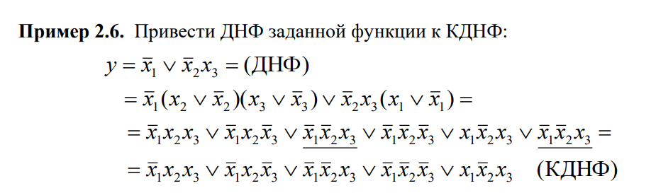
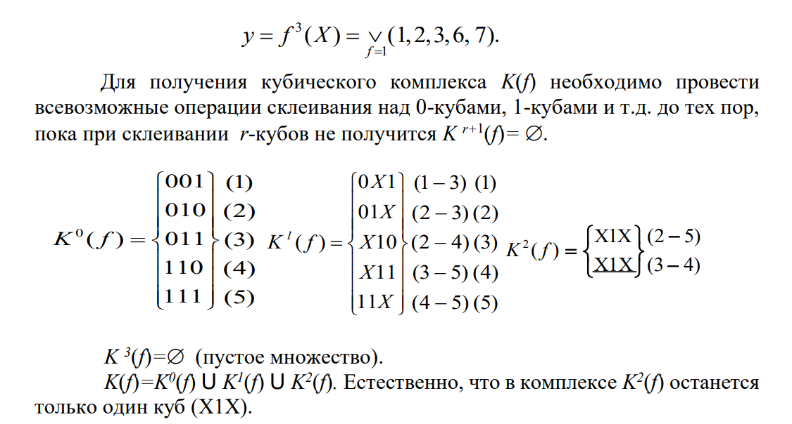

### Приведение нормальных форм к каноническим.

Для приведения ДНФ к КДНФ необходимо использовать правило дизъюнктивного развертывания применительно к каждому из неполных конъюнктивных термов. 
$P(x_i \lor \bar x_i) = P*x_i \lor P*\bar x_i$, где $P$ - неполный конъюктивный терм. 

 

<ins>Замечание</ins>. После раскрытия скобок могут получиться одинаковые термы, из которых нужно оставить только один. 

Преобразование КНФ к ККНФ реализуется путем применения правила
конъюнктивного развертывания к каждому неполному дизъюнктивному терму.  
$P = P \lor x_i \bar x_i = (P \lor x_i)(P \lor \bar x_i)$ 

 

## Кубическое представление функции

В кубическом представлении булевой функции от n переменных все
множество из $2^n$ наборов ее аргументов рассматривается как множество координат вершин n-мерного куба с длиной ребра, равной 1. 
Набор аргументов, на которых функция принимает значение 1, принято называть <b>существенными верншинами</b>. 

Существенные вершины образуеют так называемые <b>ноль-кубы (0-кубы)</b>.

Между 0-кубами существует отношение <b>соседства и определена операция склеивания</b>. Два 0-куба называются соседними, если они отличаются только по одной координате и, соответственно, могут вступать в операцию
склеивания, в результате которой получается <b>1-куб</b>.

Координата, отмечаемая символом Х, называется <b>свободной
(независимой, несвязанной)</b>, а остальные (числовые), координаты называются <b>зависимыми (связанными)</b>. 

> <b>Кубическим комплексом $K^0(f)$</b> булевой функции $f$ называется множество 0-кубов этой функции. 
> $K(f)=\cup_{r=0}^mK^r(f)$ (Кубический комплекс в общем виде - это объединение множеств кубических комплексов всех размерностей). 

 

Куб, входящий в состав кубического комплекса K(f), называется <b>максимальным</b>, если он не вступает ни в одну операцию склеивания.

Множество максимальных кубов функции f обозначается Z(f). Это множество является окончательным результатом операции склеивания кубов.

Из кубов этого множества (и только из них) строится <b>минимальное покрытие</b>
булевой функции

## Покрытия булевых функций

Между кубами различной размерности, входящими в кубический
комплекс $K(f)$, существует отношение <b>включения</b> или <b>покрытия</b>.

При этом
принято говорить, что куб $А$ меньшей размерности покрывается кубом $B$
большей размерности. Куб $А$ включается в куб $B$, если при образовании куба
$B$ хотя бы в одном склеивании участвует куб $А$.

Обозначается $A \subset B$.

Так как каждому кубу в $K(f)$ можно сопоставить конъюктивный терм, каждому $n$-размерному кубическому комплексу можно сопоставить ДНФ.

> <b>Покрытием булевой функции</b> $f$ называется такое подмножество кубов из кубического комлекса $K(f)$, которое покрывает все существенные вершины функции. 

 

> Покрытие, которое соответсвует минимальной ДНФ, называется <b>минимальным покрытием</b> и обозначается $C_{min}(f)$.

<ins>Замечание.</ins> Минимальное покрытие должно состоять только из максимальных кубов.

Множество максимальных кубов, без которых не может быть образовано покрытие булевой функции, называется <b>ядром покрытия</b> и обозначается $T(f): T(f)=\{00Х, 11Х\}$.

Минимальному пыкрытию соответсвует минимальная ДНФ (МДНФ).

## Цена покрытия

Эта оценка базируется на понятии <b>цены кубов</b>, составляющих покрытие. <b>Цена r-куба</b> $S_r$ представляет собой количество несвязанных координат: $S_r = n-r$.

Два вида цены покрытия $S^a, S^b$:

$S^a=\sum_{r=0}^m(n-r)N_r$, где $N_r$ - количество кубов размерности r. Иначе говоря, это сумма цен кубов входящих в покрытие.

$S^b = S^a + k$, где $k$ - общее количество кубов входящих в покрытие.

<b>Минимальным покрытием</b> называется покрытие, обладающее минимальной ценой $S^a$.

Цены покрытия $S^a$ и $S^b$ связаны с ДНФ, соответсвующей этому покрытию следующим образом:

* цена покрытия $S^a$ - это количество букв в ДНФ.
* цена покрытия $S^b$ - это количества букв и термов входящих в ДНФ.

Цена схемы по Квайну $S_Q$ - это кол-во суммарное число входов во все логические элементы схемы.

Единичным покрытиям соответсвуют ДНФ $(P \lor P_1 \lor \dots \lor P_i)$, нулевым покрытиям соответсвуют КНФ $(P \land P_1 \land \dots \land P_i)$.

## Импликанты буелвых функций. Системы импликант

> Булева функция $g(x)$ называется **импликантой** булевой функции $f(x)$, если для любого набора аргументов, на который $g(X)=1$, $d(x)$ так же равна единице. $g(\hat x)=1 \implies f(\hat x) = 1$, где $\hat x$ - набор аргументов.
>  

 
