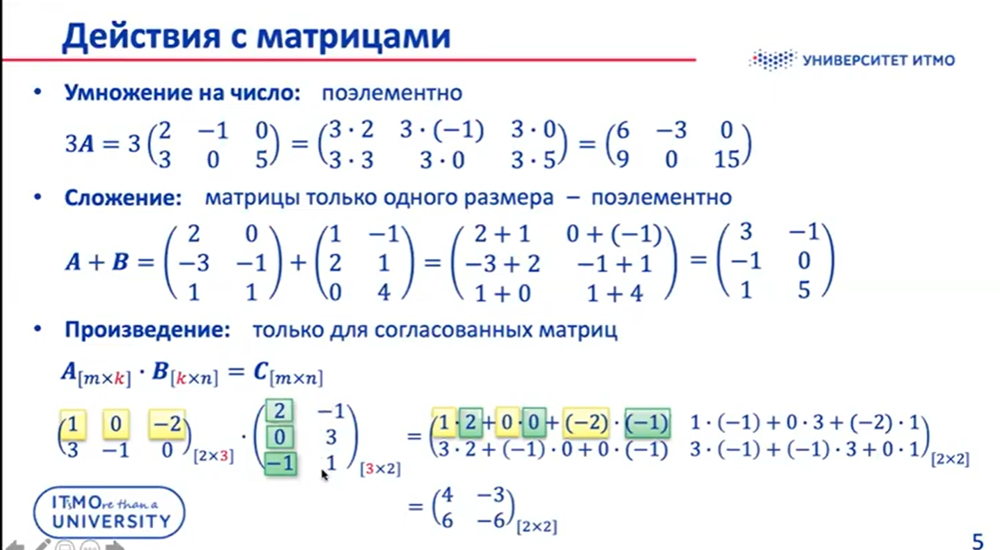
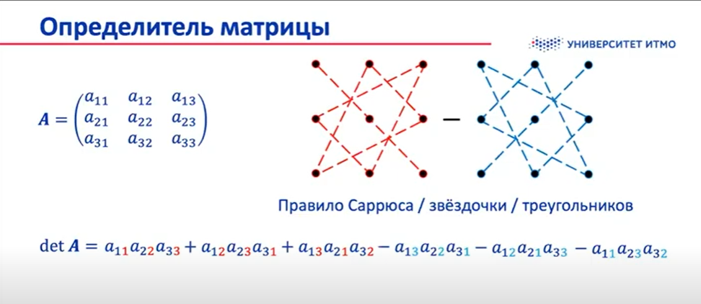
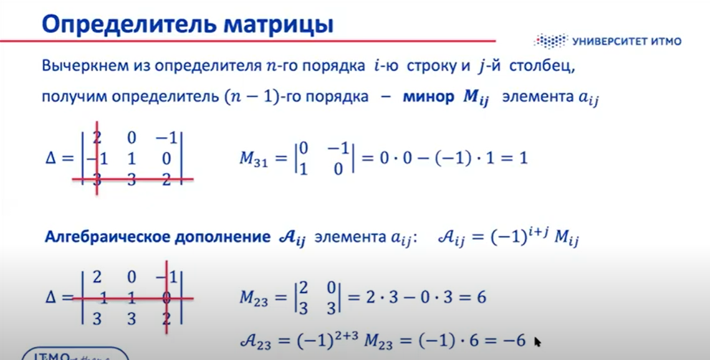
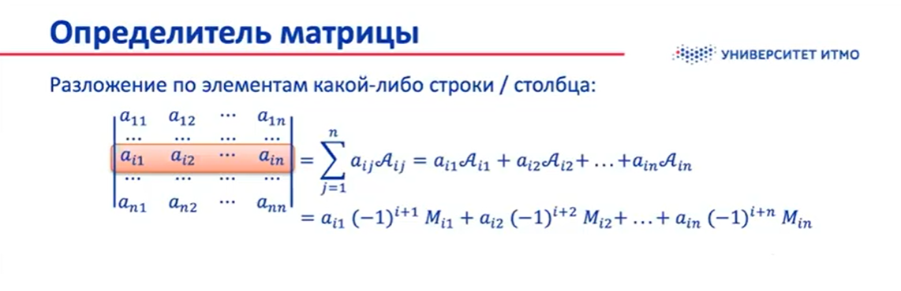
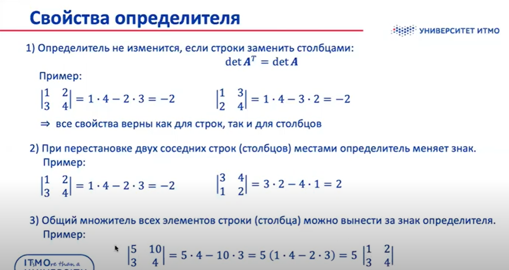
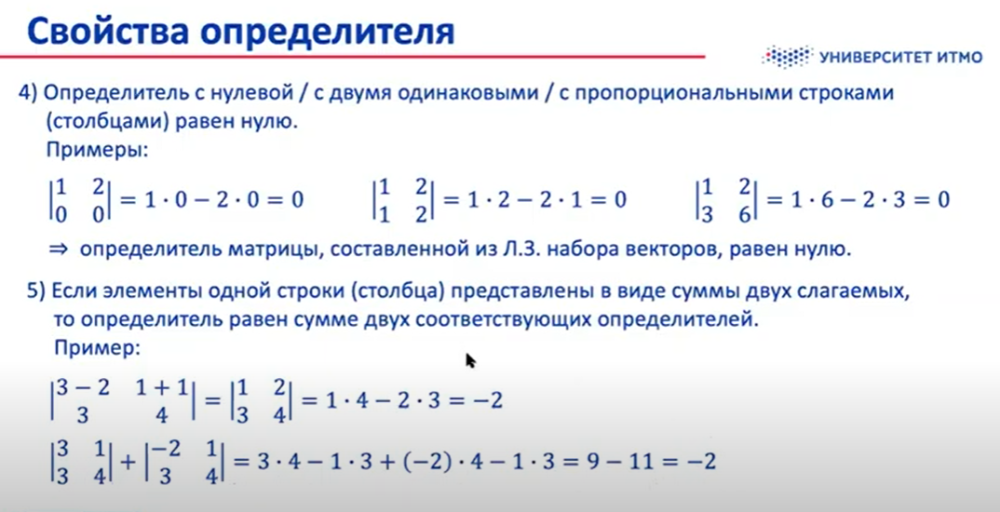
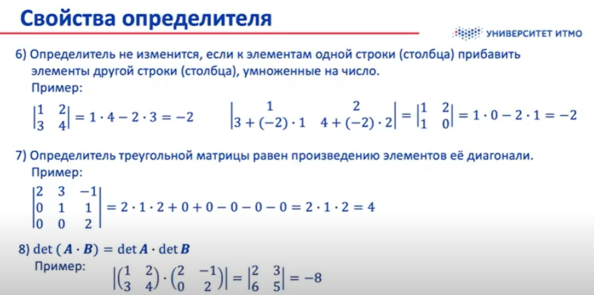
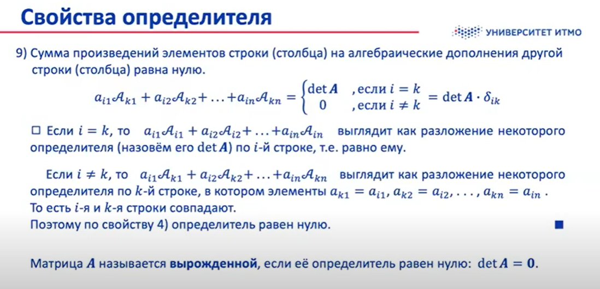

### Действия с матрицами

### Определитель матрицы

<b>Определитель (детерминант)</b> - числовая характеристика квадратной матрицы $A$.
$\Delta=detA=|A|=\sum_p{(-1)^{k(p)}a_{1j_1}a_{2j_2}\dots a_{nj_n}}$.  
$p$ - всевозможные перестановки чисел 1,2,...,n 
$k(p)$ - количество инверсий в перестановке $p$, т.е пар чисел, в которых первое больше второго. 
  
Вычеркнем из определителя n-го порядка i-ю строку и j-й столбец, получим определитель (n-1)-го порядка - <b>минор $M_{ij}$ элемента $a_{ij}$.</b>
Алгебраическое дополнение $A_{ij}$ элемента $a_{ij}:~~A_{ij}=(-1)^{i+j}M_{ij}$  

### Свойства определителя

---

> Матрица $A^{-1}$ называется обратной к $A$, если
> $A * A^{-1} = A^{-1}*A = I$ (обратные есть только у квадратных).

> <b>Теорема</b> об обратной матрице. 
> Любая невырожденная матрица имеет обратную.

$A * \frac{A^{*^T}}{detA} = I$ (доказательство.)