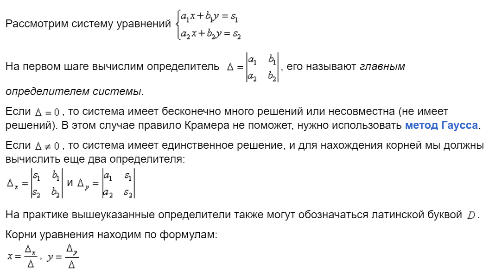

## Матричное уравнение

> <b>Теорема</b>. У матрицы существует единственная матрица обратная ей.

> <b>Теорема</b>. Для невырожденной квадратной СЛАУ (число неизвестных совпадает с числом уравнений) решение существует и единственно, т.е СЛАУ совместна и определена.

## Метод крамера.

 

## Система векторов

Линейной комбинацией элементов линейного пространства называется следующая сумма:
$\vec a_1, \vec a_2, \vec a_3, \dots, \vec a_k \in L$.

$\sum^k_{i=1}\lambda_i \vec a_i$. $\quad \lambda_1, \lambda_2, \dots, \lambda_k \in \R$ - коэффиценты линейной комбинации.

Линейная комбинация называется **тривиальной**, если все коэффиценты л.к равны 0. Иначе нетривиальная.

Система векторов (набор) называется **линейно зависимым**, если существует нетривиальная л.к, равная нулю. $\exist \lambda_n \not = 0 \in \{\lambda_1, \lambda_2, \dots, \lambda_k\}: \sum^k_{i=1}\lambda_i \vec a_i = 0$

Если набор из двух векторов линейно зависим, то векторы пропорциональны.

Набор векторов (система) называется **линейно независимой** если из равенства линейной комбинации этих векторов следует её тривиальность.
$\sum^k_{i=1}\lambda_i \vec a_i = \vec 0 \implies \lambda_1, \lambda_2,...,\lambda_k = 0$

## Свойства линейной зависимости и линейной независимости

1) Набор состоит из одного нулевого вектора: $\vec 0 \quad \lambda \vec 0 = \vec 0 \quad \forall \lambda \in \R$. (линейно зависим).
2) Набор из одного ненулевого вектора линейно независим.
3) $\vec a, \vec 0$ - линейно зависим. При добавлении к линейно независимому набору нулевого вектора, набор становится линейно зависимым.
4) $\vec a, \vec b$ - л.з $\implies \vec b = \alpha \vec a$
5) Надсистема ЛЗ векторов линейно зависима.
6) Подсистема ЛНЗ линейно независима.