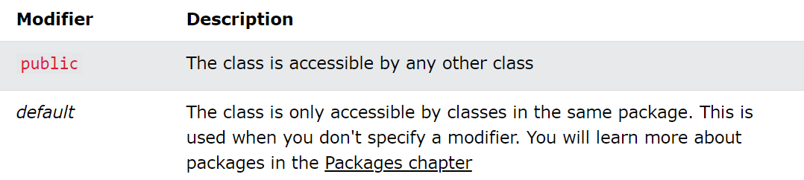
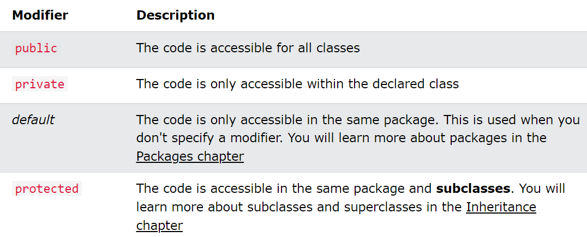
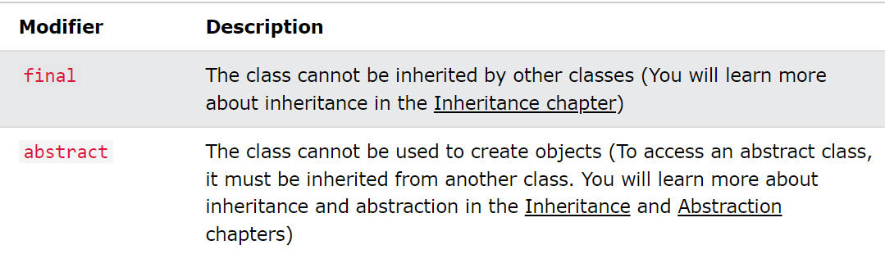
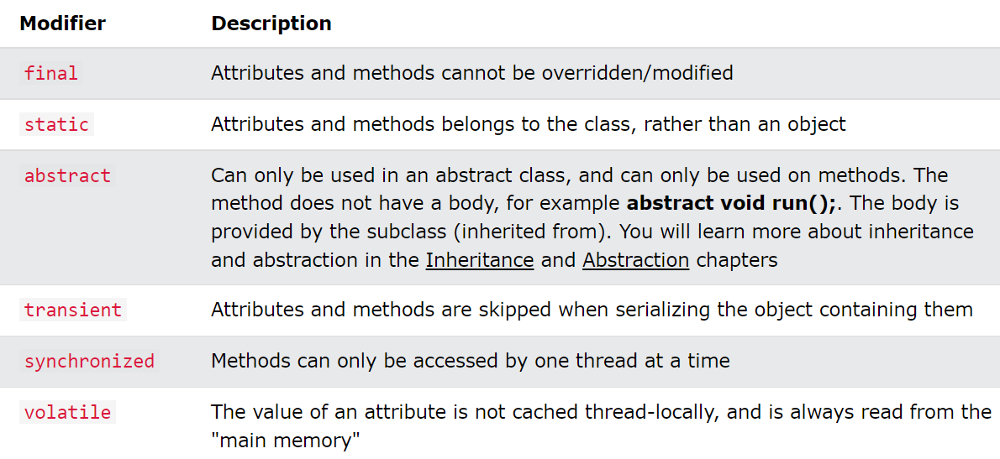

## OOP

### Methods
~~~ Java
public class Main {
  static void myMethod() {
    System.out.println("Hello World!");
  }

  public static void main(String[] args) {
    myMethod();
  }
}

~~~
### Public vs Static
You will often see Java programs that have either static or public attributes and methods.

> Static methods can be accessed without creating an object of the class, unlike public, which can only be accessed by objects.

### Java Constructors
> A constructor in Java is a special method that is used to initialize objects.

Note that the constructor name must match the class name, and it cannot have a return type (like void).

## Java Modifiers
We divide modifiers into two groups:

* Access Modifiers - controls the access level
* Non-Access Modifiers - do not control access level, but provides other functionality.

### Access Modifiers
For classes, you can use either <b>public</b> or <b>default</b>:  
For <b>attributes, methods and constructors</b>, you can use the one of the following: 
 

### Non-Access Modifiers
For <b>classes</b>, you can use either final or abstract: 
 
For attributes and methods, you can use the one of the following:  
 
## Java Encapsulation
The meaning of <b>Encapsulation</b>, is to make sure that "sensitive" data is hidden from users. To achieve this, you must:
* declare class variables/attributes as private
* provide public get and set methods to access and  update the value of a private variable

## Java Packages & API
A packeage in Java is used to group related objects classes. Packages are devided into two categories:
* Built-in Packages (packages from the java API)
* User-defined Packages (create your own packages)

The Java API is a library of prewritten classes, that are free to use, included in the Java Development Environment. 

To use a class or a package from the library, you need to use the <b>import</b> keyword
~~~ Java
import package.name.Class;   // Import a single class
import package.name.*;   // Import the whole package
~~~
---
To create a package, use the <b>package</b> keyword:
MyPackageClass.java
~~~ Java
package mypack;
class MyPackageClass {
  public static void main(String[] args) {
    System.out.println("This is my package!");
  }
}
~~~

$ javac -d . MyPackageClass.java  
$ java mypack.MyPackageClass

## Java Inheritance (Subclass and Superclass)

To inherit from a class, use the extends keyword. 
~~~ Java
class Vehicle {
    ...
}
class Car extends Vehicale {
    ...
}
~~~

## Polymorphism
Like we specified in the previous chapter; Inheritance lets us inherit attributes and methods from another class. Polymorphism uses those methods to perform different tasks. This allows us to perform a single action in different ways.
~~~ Java
class Animal {
  public void animalSound() {
    System.out.println("The animal makes a sound");
  }
}

class Pig extends Animal {
  public void animalSound() {
    System.out.println("The pig says: wee wee");
  }
}

class Dog extends Animal {
  public void animalSound() {
    System.out.println("The dog says: bow wow");
  }
}
~~~

### Java Inner Classes
In Java, it is also possible to nest classes (a class within a class).
~~~ Java
class OuterClass {
  int x = 10;

  class InnerClass {
    int y = 5;
  }
}

public class Main {
  public static void main(String[] args) {
    OuterClass myOuter = new OuterClass();
    OuterClass.InnerClass myInner = myOuter.new InnerClass();
    System.out.println(myInner.y + myOuter.x);
  }
}
~~~
An inner class can also be static, which means that you can access it without creating an object of the outer class.

## Abstract Classes and Methods
* Abstract class: is a restricted class that cannot be used to create objects (to access it, it must be inherited from another class).

* Abstract method: can only be used in an abstract class, and it does not have a body. The body is provided by the subclass (inherited from).
  
An abstract class can have both abstract and regular methods:
~~~ Java
abstract class Animal {
  public abstract void animalSound();
  public void sleep() {
    System.out.println("Zzz");
  }
}
~~~

## Java Interfaces
An <b>interface</b> is a completely "abstract class" that is used to group related methods with empty bodies:
~~~ Java
// interface
interface Animal {
  public void animalSound(); // interface method (does not have a body)
  public void run(); // interface method (does not have a body)
}

class Pig implements Animal {
    public void animalSound() {
        ...
    }
    public void run() {
        ...
    }
}
~~~
Class can implement multiple intefaces.